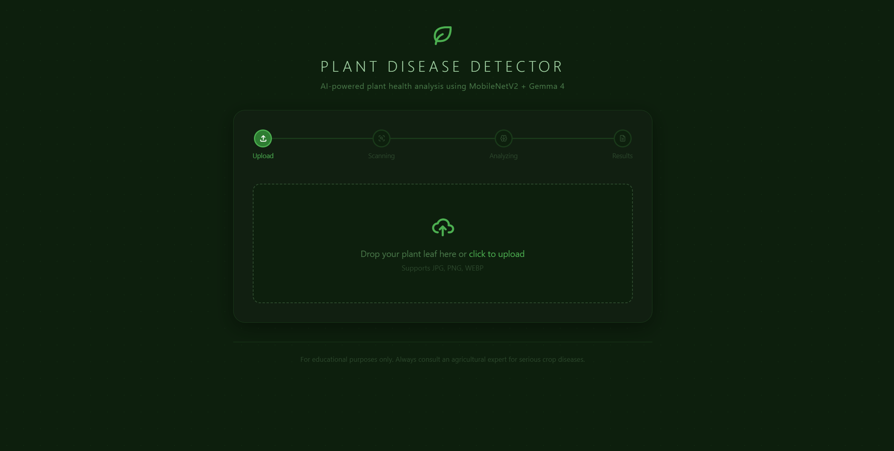

````markdown
# 🌿 FloraID – AI Plant Disease Analyzer

> An AI-powered plant disease diagnosis system that combines deep learning with Google's Gemma 4 to identify plant diseases, explain symptoms, and recommend treatments — all running locally.


---

## 🌱 About

FloraID is an AI-powered web application that helps identify plant diseases from leaf images. Instead of simply predicting a disease name, it combines image classification with Google's Gemma 4 to generate an easy-to-understand diagnosis, explain possible causes, and suggest treatment and prevention methods.

The entire workflow runs locally, making it fast, private, and suitable for demonstrations, research, and educational purposes.

---

## ✨ Features

- 🌿 AI-powered plant disease detection from leaf images
- 🧠 Detailed diagnosis generated using Google Gemma 4
- 📊 Confidence score for every prediction
- 💊 Treatment recommendations
- 🌾 Prevention and plant care suggestions
- ⚡ Fast local inference
- 🖥️ Responsive web interface
- 🔒 Local processing without sending images to cloud services

---

## 🌾 Supported Diseases

The application can identify multiple common plant diseases depending on the trained model, including:

- Early Blight
- Late Blight
- Leaf Mold
- Powdery Mildew
- Rust
- Leaf Spot
- Bacterial Spot
- Healthy Plants
- and other diseases supported by the classification model.

> ⚠️ **Disclaimer:** This project is intended for educational and research purposes. Results should not replace professional agricultural advice.

---

## 🛠️ Tech Stack

| Layer | Technology |
|--------|------------|
| Frontend | HTML, CSS, JavaScript |
| Backend | Node.js, Express.js |
| AI Server | Python, Flask |
| Image Classification | MobileNetV2 (Hugging Face) |
| AI Assistant | Google Gemma 4 via Ollama |
| Image Processing | Pillow |

---

## ⚙️ Setup & Installation

### Prerequisites

- Node.js v18+
- Python 3.10+
- Ollama installed
- Gemma 4 downloaded
- Internet connection for the first model download

---

### Step 1: Clone the repository

```bash
git clone https://github.com/Charminglance/Ai-Plant-Disease-Detector.git

cd Ai-Plant-Disease-Detector
```

---

### Step 2: Install Node dependencies

```bash
npm install
```

---

### Step 3: Install Python dependencies

```bash
pip install flask transformers pillow torch torchvision requests
```

---

### Step 4: Pull Gemma 4

```bash
ollama pull gemma4
```

---

### Step 5: Start Ollama

```bash
ollama serve
```

---

### Step 6: Start the AI server

```bash
python gemma_server.py
```

Wait until the server is ready.

---

### Step 7: Start the Node server

```bash
node server.js
```

---

### Step 8: Open the application

Visit

```
http://localhost:3000
```

---

## 📁 Project Structure

```text
Ai-Plant-Disease-Detector/
├── index.html
├── style.css
├── script.js
├── server.js
├── gemma_server.py
├── package.json
├── package-lock.json
└── .gitignore
```

---

## 📸 Demo

> Upload a plant leaf image → AI identifies the disease → Gemma generates a detailed explanation with treatment and prevention recommendations.



---

## 💡 How It Works

1. Upload a leaf image.
2. The Node.js server receives the image.
3. The image is sent to the Python AI server.
4. A MobileNetV2 model classifies the disease.
5. The prediction and confidence score are passed to Google Gemma 4 through Ollama.
6. Gemma generates a detailed diagnosis, treatment suggestions, and preventive measures.
7. The complete report is displayed in the web interface.

---

## 🚀 Future Improvements

- Camera capture support
- More plant species
- Disease severity estimation
- Organic treatment suggestions
- Fertilizer recommendations
- PDF report export
- Scan history
- Mobile application
- Multilingual support

---

## 👨‍💻 Built By

**Safeel** — Final Year B.Tech Computer Science Student, MES College of Engineering, Kuttippuram

- 🌐 https://safeel.in
- 💼 https://linkedin.com/in/itssafeel
- 🐙 https://github.com/Charminglance
- 📸 https://instagram.com/safeel_z

---

## 📄 License

MIT License — feel free to use, modify, and build upon this project.
````
